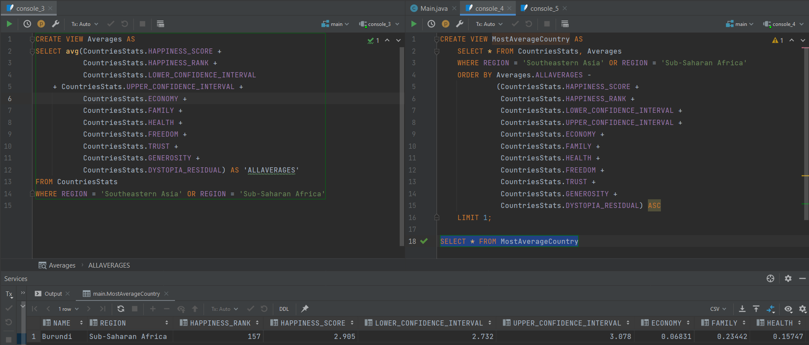

## Страна с самым низким уровнем щедрости среди всех стран 'Middle East and Northern Africa' и 'Central and Eastern Europe'

## Страна с самыми средними показателями в регионах 'Southeastern Asia' и 'Sub-Saharan Africa'
